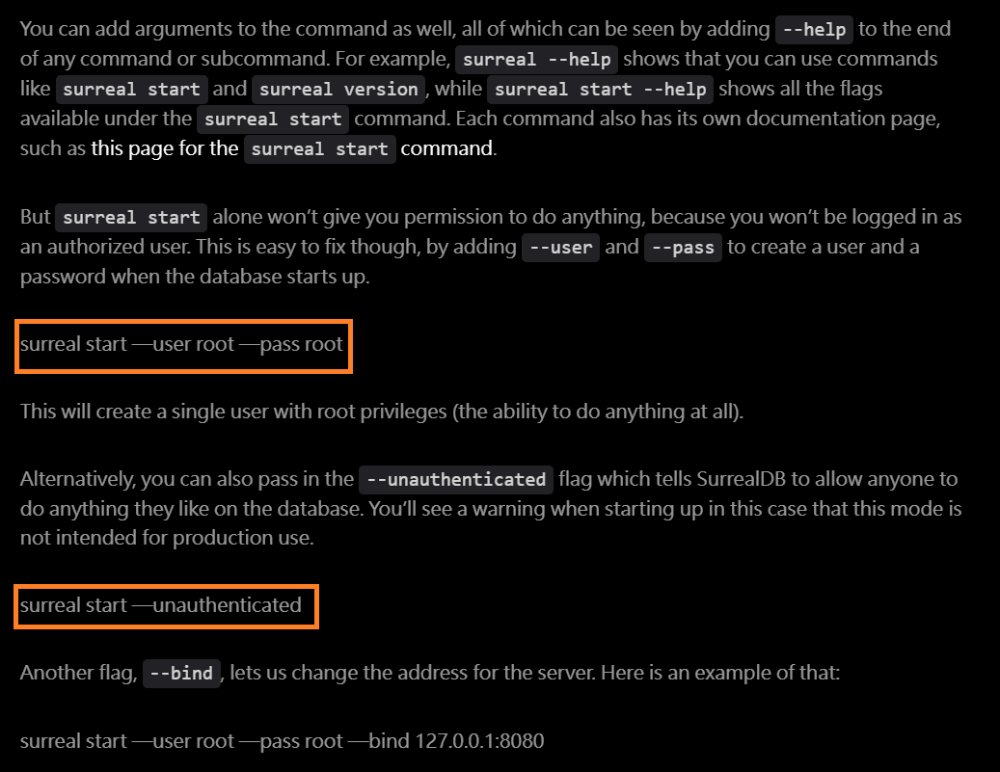
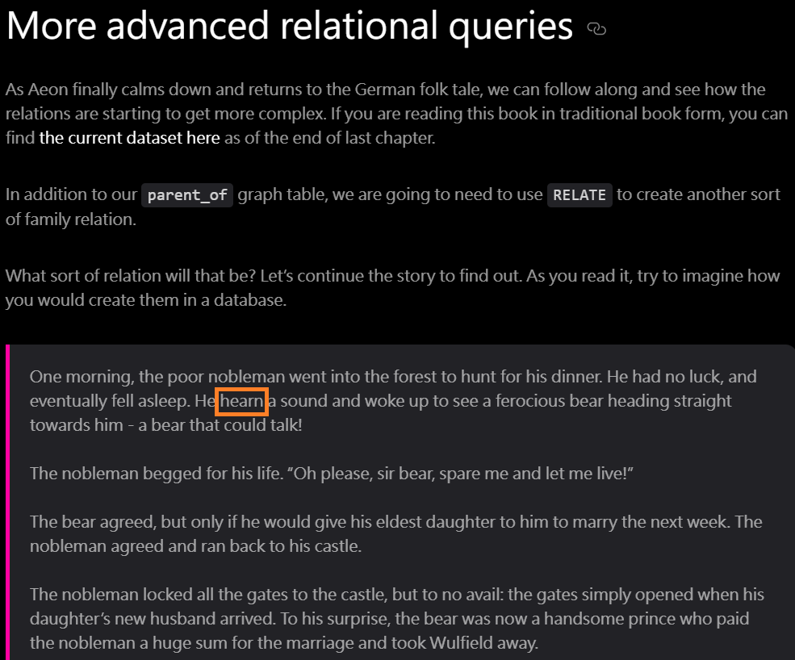

# chappe-telegraph

This repo contains minor improvements that could potentially be made for the book [*Aeon's Surreal Renaissance*](https://surrealdb.com/learn/book) after reading it (2024/Oct/22).

## ch01
* The code block is not wrapped in the appropriate CSS class. [(Link)](https://surrealdb.com/learn/book/chapter-01#installing-starting-and-connecting-to-surrealdb)



## ch03
* Duplicated dot. [(Link)](https://surrealdb.com/learn/book/chapter-03#surrealdb-architecture)


* `town` field should be `population` field. [(Link)](https://surrealdb.com/learn/book/chapter-03#the-null-and-none-types)


* `WHEN` should be `WHERE`. [(Link)](https://surrealdb.com/learn/book/chapter-03#5-how-would-you-then-return-all-of-these-towns-if-their-name-is-greater-than-the-value-m)


## ch04
* The bottom `person:7ykci42eb08vszvcur2t` is not highlighted in blue like the top one. [(Link)](https://surrealdb.com/learn/book/chapter-04#returning-before-after-and-more)


* `$town` is not highlighted. [(Link)](https://surrealdb.com/learn/book/chapter-04#for-loops)


* `string::is::datetime(` is not properly formatted. [(Link)](https://surrealdb.com/learn/book/chapter-04#datetimes-string-prefixes-durations-and-sleeping)


## ch05
* I suggest using `TABLE` consistently instead of `table` in this schema only.
[(Link)](https://surrealdb.com/learn/book/chapter-05#schema-basics)


* Using `INFO FOR TABLE` would be preferable to using `INFO FOR table`.
[(Link)](https://surrealdb.com/learn/book/chapter-05#info-for-table-and-properties-inside-arrays)


## ch06
* Query should be `UPDATE person:the_nobleman SET children = [person:wulfield];`.
[(Link)](https://surrealdb.com/learn/book/chapter-06#relate)


## ch07
* Typo: `hearn` should be `heard`.
[(Link)](https://surrealdb.com/learn/book/chapter-07#more-advanced-relational-queries)



## ch09
* The code block is not wrapped in the appropriate CSS class.
[(Link)](https://surrealdb.com/learn/book/chapter-09#strictness-across-the-entire-database)


## ch10
* Rendering issue here.
[(Link)](https://surrealdb.com/learn/book/chapter-10#geo-functions)


* `651898892358.2931f` is not highlighted.
[(Link)](https://surrealdb.com/learn/book/chapter-10#geo-functions)


* `..>` should be `>..`.
[(Link)](https://surrealdb.com/learn/book/chapter-10#comparing-values-and-complex-record-id-behaviour)


## ch12
* `backticks` issue here.
[(Link)](https://surrealdb.com/learn/book/chapter-12#changefeeds-and-the-show-statement)


* Extra line. 
[(Link)](https://surrealdb.com/learn/book/chapter-12#3-the-following-data-is-divided-into-planet-star-and-moon-record-types-using-method-syntax-how-could-you-combine-them-into-a-single-array-of-objects-that-has-the-table-name-as-the-type-and-the-table-id-as-its-name)


## ch14

* This chapter utilizes [this dataset](https://datasets.surrealdb.com/learn/book/book-part-8-dataset.surql). However, to achieve the results shown below, we need to add `DEFINE FIELD name ON TABLE building TYPE string;`.
[(Link)](https://surrealdb.com/learn/book/chapter-14#using-the-explorer-view-to-visualize-relations)


## ch17
* Rendering issue here. [(Link)](https://surrealdb.com/learn/book/chapter-17#viewing-external-dependencies-inside-cargotoml)


## ch18
* It appears that `RETURN (SELECT VALUE languages FROM movie).distinct().flatten();` (incorrect) is not equivalent to `RETURN (SELECT VALUE languages FROM movie).flatten().distinct();` (correct).
[(Link)](https://surrealdb.com/learn/book/chapter-18#genres-languages)


* This chapter utilizes [this dataset](https://datasets.surrealdb.com/learn/book/book-naive-movies.surql) that contains `NONE` in the `Language` field, which is quite interesting.
```
{
		Actors: 'Charles Chaplin, Virginia Cherrill, Florence Lee',
		Awards: '3 wins & 1 nomination',
		BoxOffice: '$19,181',
		Country: 'United States',
		DVD: '23 Feb 2010',
		Director: 'Charles Chaplin',
		Genre: 'Comedy, Drama, Romance',
		Language: 'None, English',
        ...
}
```

## ch21

* Typo: duplicated `"think"`. [(Link)](https://surrealdb.com/learn/book/chapter-21#a-farewell-to-failure)

